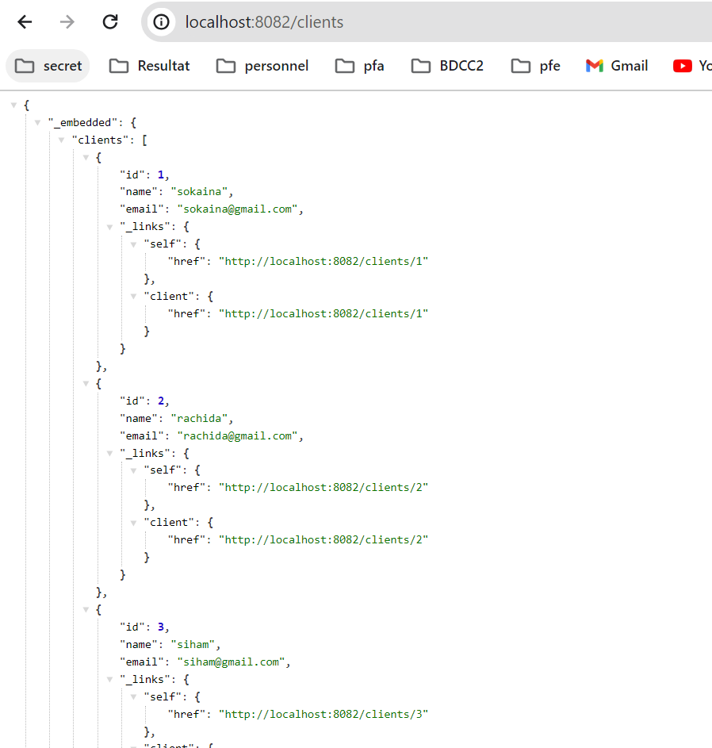

# sokaina-daabal-enset-adria-test
## UN POC base sur une architecture micro service 
### Architectures de projets 
Notre projet contient 4 microservices dans le but de gérer des portefeuilles de devises. Nous utilisons Consul comme service de découverte, un service de configuration basé sur Consul Config, et une passerelle (gateway). De plus, nos deux microservices, wallet-service, gèrent les portefeuilles des clients, et transfers-service s'occupe des transactions de fichiers.


### Dependences :
Pour les deux micro-services:
  - Spring Data Jpa 
  - Spring we
  - Lombok
  - h2 database
  - Rest Repository
  - Consul client
  - config client
  - spring boot actuator
Pour la configuration consul :
  - Config service
  - Spring boot actuator
  - consul discovery
Pour la gateway :
  - Gateway
  - Spring boot actuator
  - Consul Discovery
### Demarage de service 

d'abord en commence par exectuer consul 
```shell
consul agent -server -bootstrap-expect=1 -data-dir=consul-data -ui -bind=192.168.1.3
```

Pour consulter consul, utiliser l'URL suivant : http://localhost:8500/ui/dc1/services

on acces a config-repo en terminal puis en lance les commandes suivant :

```shell
git init
git add .
git commit -m "version1"
```
et en demmare nos service 


### Wallet-service
#### Entities 
##### client 
```java
@Entity
@Data
@Builder
@AllArgsConstructor
@NoArgsConstructor
public class Client {
    @Id
    @GeneratedValue(strategy = GenerationType.AUTO)
    private Long id;
    private String name;
    private String email;
}
```

#### wallet
```java
@Entity
@Data
@Builder
@AllArgsConstructor
@NoArgsConstructor
public class Wallet {

    @Id
    @GeneratedValue(strategy = GenerationType.UUID)
    private UUID id; 
    private double solde;
    private Date createdAt;

    private String devis;

    private Long clientId;

    @Transient
    private Client client;
}
```
Ensuite, nous avons créé les référentiels (repositories) et la fonction 'start' avec l'annotation 'bean', qui nous permet d'insérer les clients dans notre base de données et de les lier à leur portefeuille. 

### Test 

Après avoir effectué les configurations nécessaires, nous avons réussi à créer nos clients et les lier à leur portefeuille.

#### h2 : une base de donne de test 


### Service




a ce stade le service a pres peut consomer.

### transfers-service
